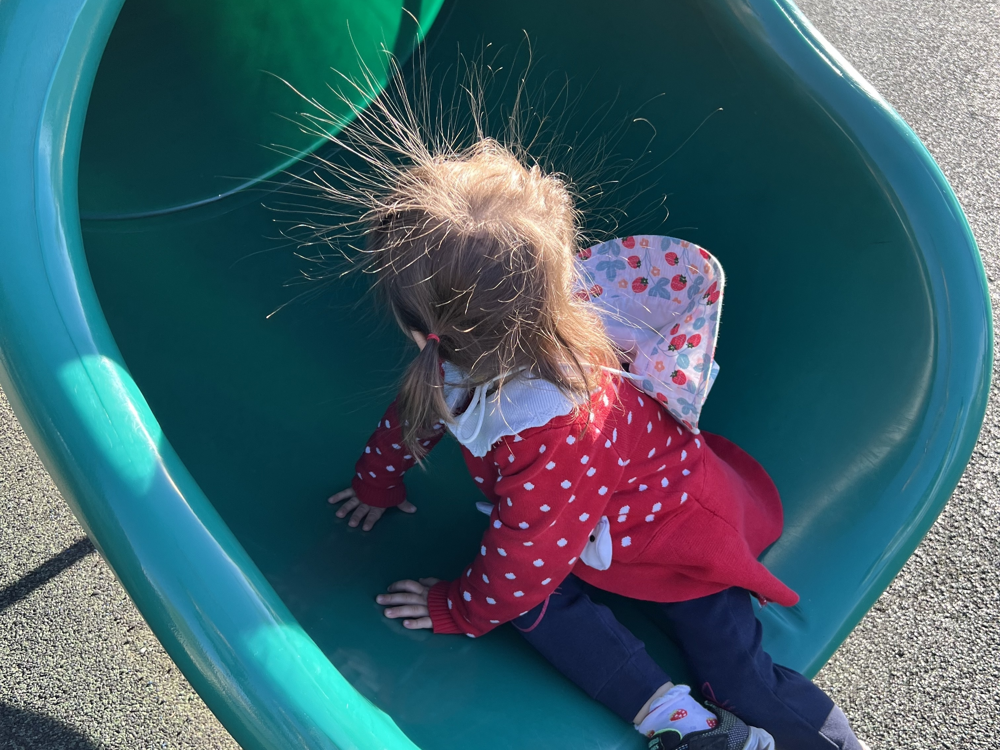
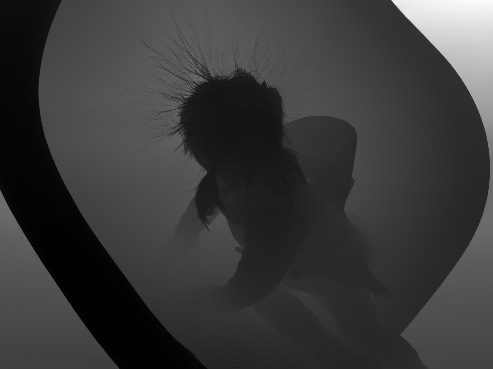
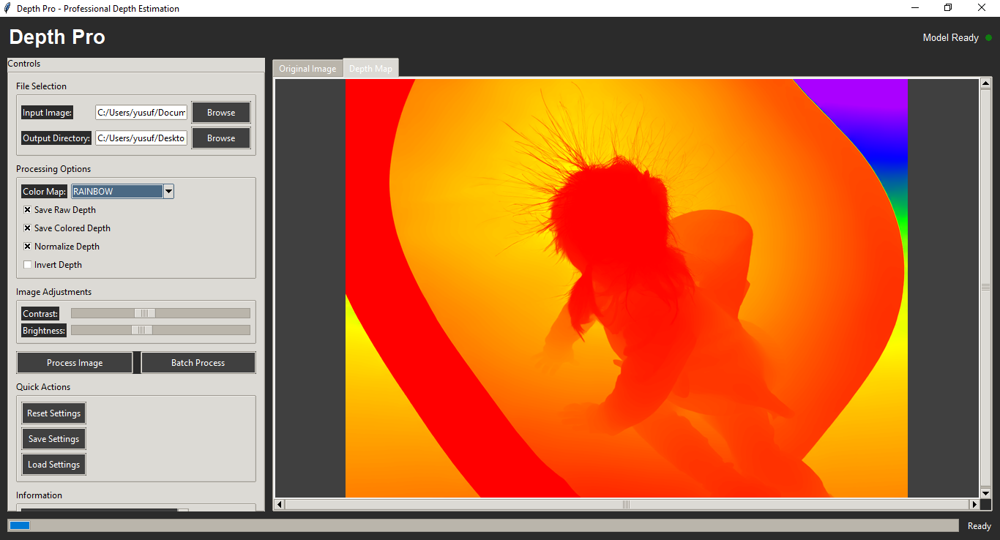

[English](README_EN.md)

# ML Depth Pro

Apple'ın açık kaynaklı derinlik tahmin modeli "Depth Pro"yu kolayca kullanmanızı sağlayan bir araçtır. Bu proje ile tek bir RGB fotoğraftan yüksek kaliteli derinlik haritaları üretebilirsiniz.

## Çıktı Örnekleri
| Girdi | Derinlik (Ham) | Derinlik (Renkli) |
|-------|----------------|-------------------|
|  |  | 

## Özellikler
- Tek bir resimden hızlı ve doğru derinlik haritası üretimi
- Hem komut satırı (CLI) hem de grafik arayüz (GUI) ile kullanım
- Farklı renk haritaları ile görselleştirme
- Kolay kurulum ve kullanım

## Kurulum
1. **Python 3.8+** yüklü olmalı.
2. Gerekli paketleri yükleyin:
   ```bash
   pip install -r requirements.txt
   ```
3. Model dosyasını indirin:
   ```bash
   python model_downloader.py
   ```

## Kullanım

### Komut Satırı (CLI)
Bir resimden derinlik haritası üretmek için:
```bash
python cli_tool.py -i <giris_resmi.jpg> -o <cikis_derinlik.png>
```
Örnek:
```bash
python cli_tool.py -i images/IMG.jpg -o outputs/IMG_depth_raw.png
```

### Grafik Arayüz (GUI)


Kolayca resim seçip derinlik haritası oluşturmak için:
```bash
python depth_gui.py
```
Arayüzde resim seçin, renk haritası belirleyin ve sonucu kaydedin.

## Sıkça Sorulan Sorular

**Soru:** Model dosyasını indiremiyorum, ne yapmalıyım?
> `model_downloader.py` dosyasını çalıştırdığınızdan emin olun. İnternet bağlantınızı kontrol edin.

**Soru:** Sonuçlar bulanık veya hatalı, neden?
> Girdi resminin net ve yüksek çözünürlüklü olmasına dikkat edin. Model, portre ve manzara fotoğraflarında en iyi sonucu verir.

## Katkıda Bulunma
Katkılarınızı bekliyoruz! Hataları bildirebilir veya yeni özellikler ekleyebilirsiniz.

## Lisans
Bu proje Apple Inc.'in açık kaynak lisansı ile sunulmuştur. Detaylar için `LICENSE` dosyasına bakınız.
