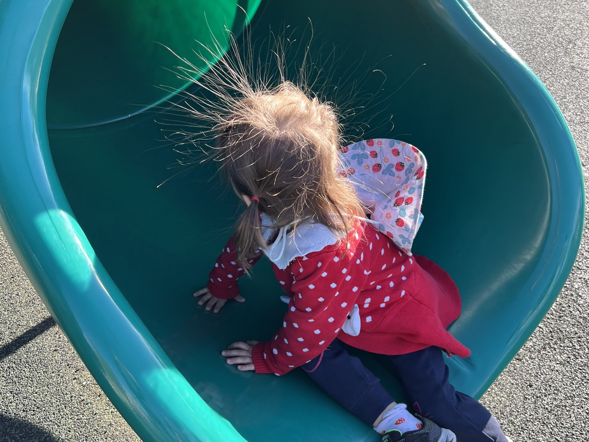
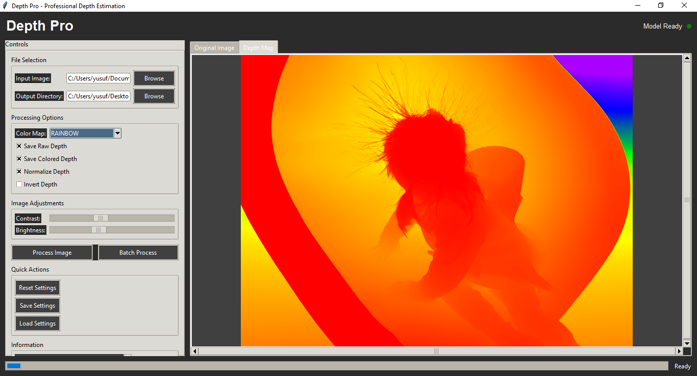

[Türkçe](README.md)

# ML Depth Pro

ML Depth Pro is a tool that allows you to easily use Apple's open-source depth estimation model "Depth Pro". With this project, you can generate high-quality depth maps from a single RGB photo.

## Output Examples
| Input | Depth (Raw) | Depth (Colored) |
|-------|-------------|-----------------|
|  |  | 

## Features
- Fast and accurate depth map generation from a single image
- Usable via both command line (CLI) and graphical interface (GUI)
- Visualization with different color maps
- Easy setup and usage

## Installation
1. **Python 3.8+** must be installed.
2. Install the required packages:
   ```bash
   pip install -r requirements.txt
   ```
3. Download the model file:
   ```bash
   python model_downloader.py
   ```

## Usage

### Command Line (CLI)
To generate a depth map from an image:
```bash
python cli_tool.py -i <input_image.jpg> -o <output_depth.png>
```
Example:
```bash
python cli_tool.py -i images/IMG.jpg -o outputs/IMG_depth_raw.png
```

### Graphical Interface (GUI)


To easily select an image and generate a depth map:
```bash
python depth_gui.py
```
Select an image in the interface, choose a color map, and save the result.

## Frequently Asked Questions

**Q:** I can't download the model file, what should I do?
> Make sure you have run `model_downloader.py`. Check your internet connection.

**Q:** The results are blurry or incorrect, why?
> Make sure the input image is clear and high-resolution. The model works best with portrait and landscape photos.

## Contributing
We welcome your contributions! You can report bugs or add new features.

## License
This project is provided under Apple Inc.'s open-source license. See the `LICENSE` file for details.
